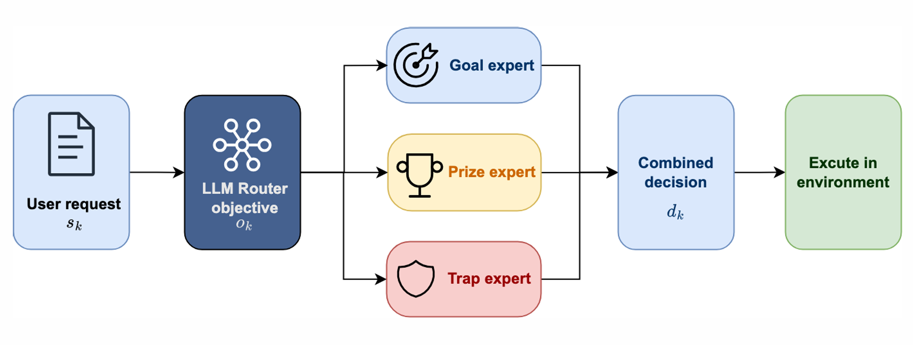
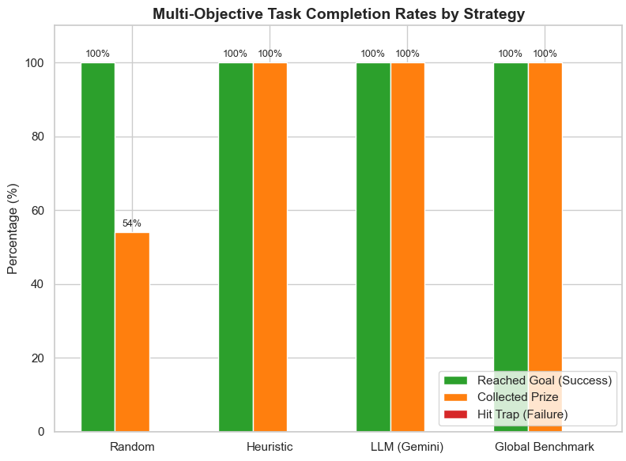
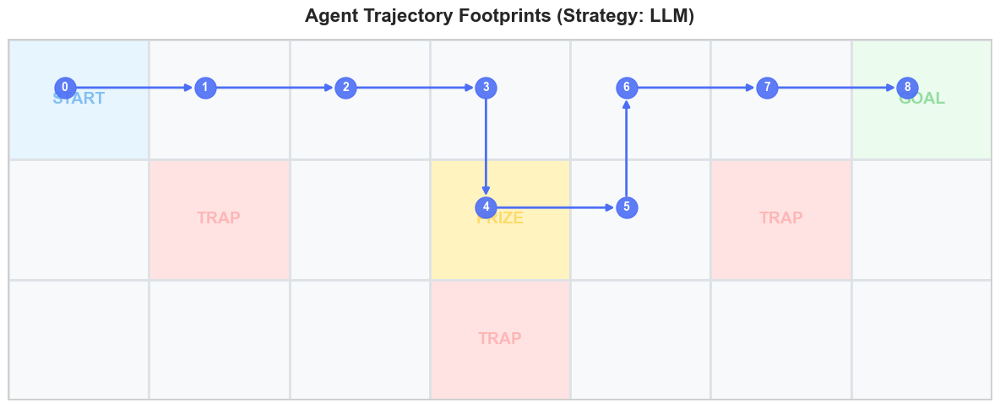
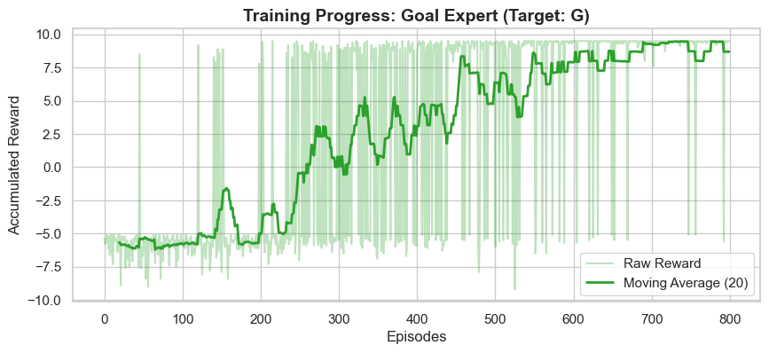
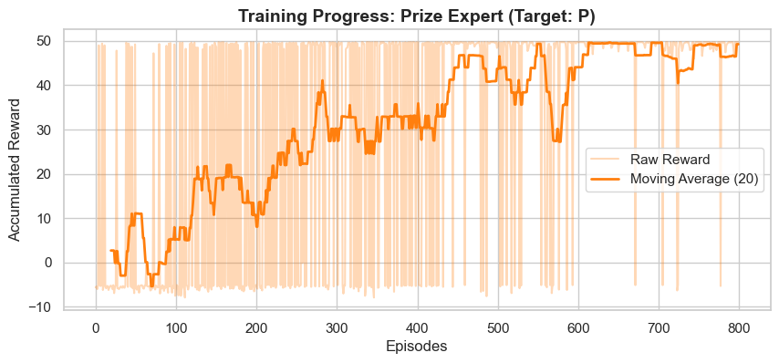
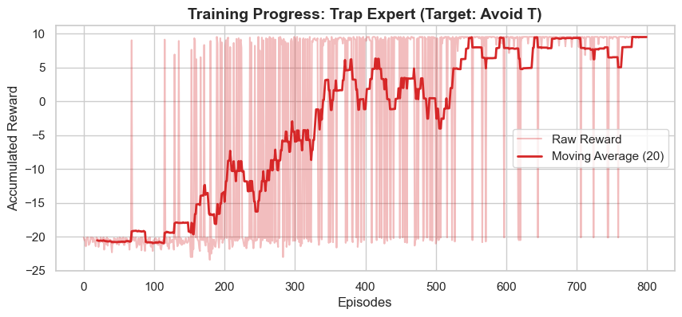
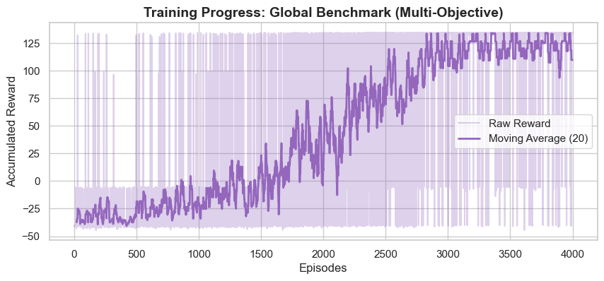

# LLM-Guided Mixture-of-Experts for Grid-World Navigation

**An experimental framework combining Large Language Models (LLMs) and Deep Reinforcement Learning for multi-objective navigation.**


## Overview

This project explores how a Large Language Model can act as a routing mechanism in a Mixture-of-Experts (MoE) system.

Instead of relying on a single reinforcement learning agent, the system uses three specialized Deep Q-Networks (DQNs), each trained to prioritize a different objective in a custom grid-world environment.

An LLM-based router selects an appropriate expert based on the current task context. The selected expert then determines the action to execute.

The project evaluates whether LLM-guided expert routing can coordinate specialized agents effectively compared with conventional routing strategies.

## System Architecture



*The LLM router selects one of three specialized DQN experts based on the current task context. The selected expert determines the action executed in the maze environment.*

## Specialized Experts

| Expert | Primary Objective |
|---|---|
| Goal Expert | Navigate towards the goal |
| Prize Expert | Prioritize collecting the prize |
| Trap Expert | Avoid dangerous cells |

Each expert is implemented using a Deep Q-Network trained with a task-specific reward function.

## Evaluation Strategies

Four strategies are compared:

1. **Random Routing:** Randomly selects an expert.
2. **Heuristic Routing:** Uses predefined rules to select an expert.
3. **LLM-Guided Routing:** Uses Google Gemini to select an expert based on the current context.
4. **Global DQN:** Uses a single model without expert routing.

The evaluation considers goal-reaching rate, prize collection rate, trap encounter rate, episode rewards, and navigation steps.

The LLM router includes error handling and a heuristic fallback when API requests fail or produce invalid responses.

## Experimental Results

### Evaluation Across Routing Strategies

The four routing strategies were evaluated on a fixed **3 × 7 grid-world**, with **50 episodes per strategy**. Goal-reaching, prize collection, and trap encounters are reported as separate metrics.



| Strategy | Reached goal | Collected prize | Hit trap |
|---|---:|---:|---:|
| Random expert routing | 100% | 54% | 0% |
| Heuristic expert routing | 100% | 100% | 0% |
| LLM-guided routing (Gemini) | 100% | 100% | 0% |
| Global DQN benchmark | 100% | 100% | 0% |

**Key observation:** All four strategies reached the goal and avoided traps in this experiment. However, random expert routing collected the prize in only 54% of episodes, compared with 100% for the other three approaches. The LLM-guided approach matched the heuristic and global DQN benchmarks on these reported task-completion metrics; these results **do not demonstrate an advantage over those two baselines**.

> **Evaluation note:** The Gemini router can fall back to heuristic routing if a request fails or returns an invalid response. The current results do not separate successful Gemini calls from fallback decisions. The findings are limited to this small, predefined maze.

### Example Navigation Trajectory



*Example LLM-guided trajectory in the 3 × 7 maze. The agent collects the prize, avoids the trap cells, and reaches the goal in eight moves. This illustration represents one run, not the aggregate behavior of all evaluation episodes.*

### DQN Training Progress

The following learning curves show episode rewards and a 20-episode moving average for the three specialized DQN experts and the single global benchmark.

<details>
<summary><strong>Expand to view the four training curves</strong></summary>

| Goal Expert | Prize Expert |
|:---:|:---:|
|  |  |
| Trap-Avoidance Expert | Global DQN Benchmark |
|  |  |

The moving averages generally increase during training, although individual episodes remain variable. Since the agents use different task-specific reward functions, their absolute reward magnitudes should **not** be compared directly.

</details>

## Technologies

- **Language:** Python
- **Deep Learning:** TensorFlow / Keras
- **Reinforcement Learning:** Deep Q-Network (DQN)
- **Environment:** Gymnasium, NumPy
- **LLM Integration:** Google Gemini API
- **Visualization:** Matplotlib, Seaborn
- **Development:** Jupyter Notebook

## Getting Started

### Installation

Clone the repository:

```bash
git clone https://github.com/XiyingYong/llm-moe-gridworld.git
cd llm-moe-gridworld
```

Install the required dependencies:

```bash
pip install -r requirements.txt
```

### Test the Environment

```bash
python test_maze_environment.py
```

This runs a basic smoke test of the custom maze environment.

### Model Training

Open `train_four_dqn_models.ipynb` to train the specialized DQN models and the global benchmark.

### Evaluation

Open `evaluate_moe_routing.ipynb` to inspect the routing strategies and evaluation workflow.

**Note:** The current public repository contains the source code but does not yet include the trained model weights or cached evaluation results. These artifacts are required for the corresponding evaluation and verification steps.

### Gemini API Configuration

Gemini-based routing requires an API key.

Set the environment variable before running the notebook:

```bash
export GEMINI_API_KEY="your-api-key"
```

On Windows PowerShell:

```powershell
$env:GEMINI_API_KEY = "your-api-key"
```

Never commit API keys or other credentials to the repository.

## Project Limitations

- The current experiments use a small, predefined grid-world.
- The LLM router requires access to an external API.
- Failed LLM requests may trigger heuristic fallback.
- Generalization to larger or unseen environments remains to be investigated.

## Project Background

Developed as a university course project to investigate LLM-assisted expert selection and reinforcement learning.

The project focuses on implementing, comparing, and evaluating different expert-routing mechanisms.
